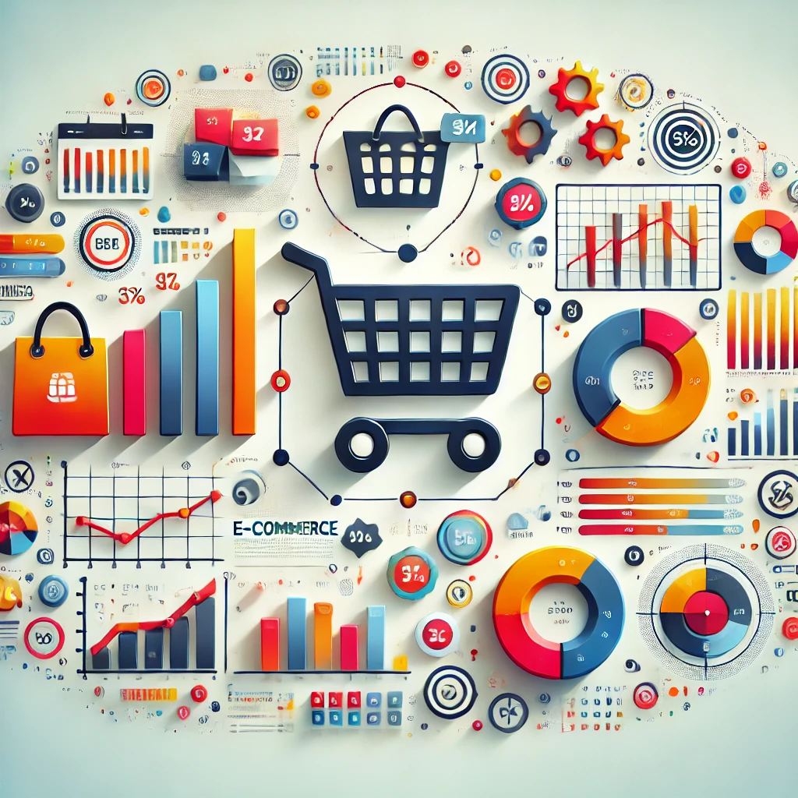

# E-Commerce Data Analysis Project 🛒

This project provides a comprehensive analysis of an e-commerce dataset, uncovering insights into customer behavior, product trends, and sales patterns. The goal is to enable data-driven decision-making for inventory management, marketing strategies, and customer engagement.

---

## **Project Overview** 📊

The dataset contains information about customer orders, including product categories, payment methods, order statuses, and transaction dates. The analysis focuses on answering key business questions and identifying actionable insights.

    

---

## **Dataset** 📂

The dataset used in this project is **Pakistan's Largest E-Commerce Dataset**, available on Kaggle. You can download it from the link below:

🔗 [Download Dataset](https://www.kaggle.com/datasets/zusmani/pakistans-largest-ecommerce-dataset)

---

## **Key Questions Answered** ❓

1. **What is the best-selling category?**  
   - Identified the most popular product categories based on order volume.
   
2. **What are the most common payment methods and order statuses?**  
   - Visualized the frequency of payment methods and order statuses.

3. **Is there a correlation between payment methods and order statuses?**  
   - Analyzed the relationship between payment methods and order outcomes.

4. **How do sales vary by year-month and product category?**  
   - Explored seasonal trends in product sales.

5. **Are there any hidden or counter-intuitive patterns?**  
   - Discovered unexpected insights, such as higher discounts not always driving larger order quantities.

6. **Can we predict the number of orders or customer behavior?**  
   - Built a machine learning model to forecast the number of orders.

---

## **Technologies Used** 🛠️

- **Python Libraries:**
  -  for data manipulation.
  -  and  for data visualization.
  -  for predictive modeling.
- **Data Analysis:**
  - Feature engineering, data cleaning, and exploratory data analysis (EDA).
- **Machine Learning:**
  - Linear regression for predicting the number of orders.
